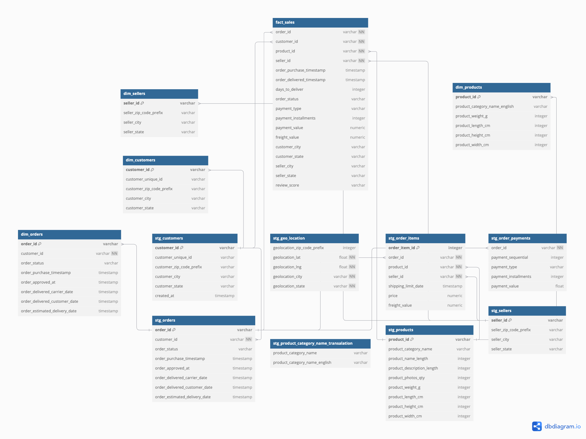
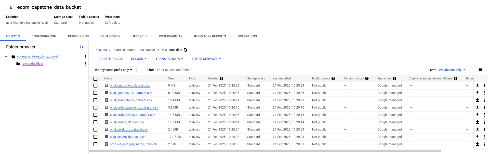
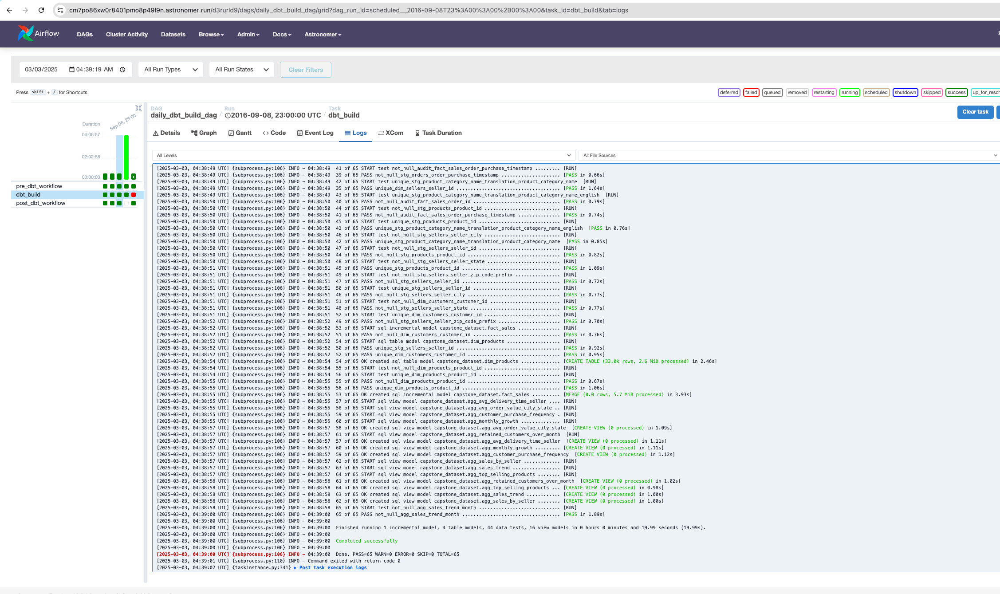
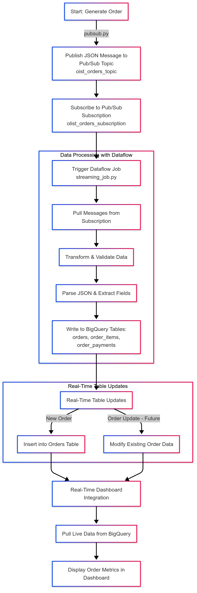
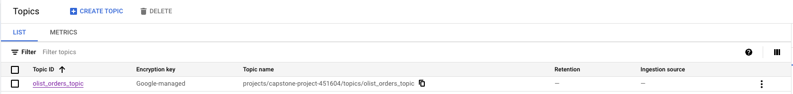
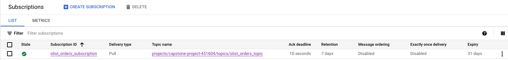
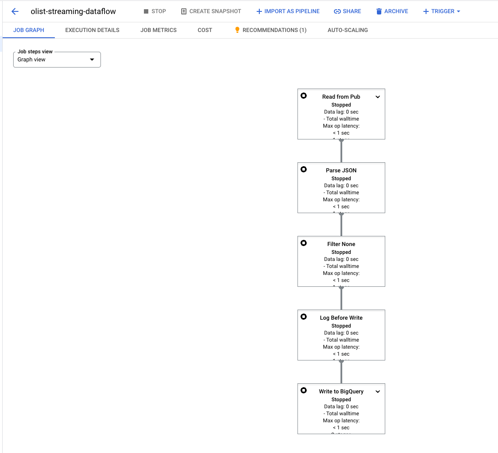
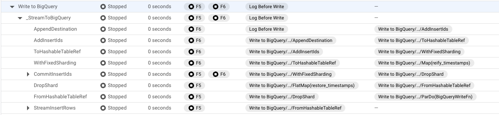

# Project Overview

### About
This project is a capstone project for Zach Wilson's Dataexpert.io Data Engineering bootcamp 
In this project, I wanted to apply as many skills as I learnt in the bootcamp, so I took opensource dataset called Brazilian E-Commerce Public Dataset by Olist. 


## Capstone Requirements

* Identify a problem you'd like to solve.
* Scope the project and choose datasets.
* Use at least 2 different data sources and formats (e.g., CSV, JSON, APIs), with at least 1 million rows.
* Define your use case: analytics table, relational database, dashboard, etc.
* Choose your tech stack and justify your choices.
* Explore and assess the data.
* Identify and resolve data quality issues.
* Document your data cleaning steps.
* Create a data model diagram and dictionary.
* Build ETL pipelines to transform and load the data.
* Run pipelines and perform data quality checks.
* Visualize or present the data through dashboards, applications, or reports.
* Your data pipeline must be running in a production cloud environment

## Project Overview
This project is a real-time data pipeline that works with multiple services like Pub/Sub, Google BigQuery, Airflow(Astronomer), DBT and Tableau to monitor order data and other KPIs.

### Problem Statement
* This an attempt to create an entire data warehouse needed for e-comm platform.

## **Key Performance Indicators (KPIs)**  

### **1. Aggregated Monthly Customer Growth**  
**Description:** Measures the total customer growth on a monthly basis.  
**Use Case:** Helps track customer acquisition trends and evaluate the impact of marketing campaigns, seasonal changes, or business strategies on customer growth.  

### **2. Top-Selling Products**  
**Description:** Identifies the top-selling products over time with options for different time granularities (daily, monthly, yearly).  
**Use Case:** Assists in inventory management, product demand forecasting, and marketing strategies for high-performing products.  

### **3. Sales by Sellers**  
**Description:** Calculates total sales per seller and identifies top-performing sellers along with their best-selling products.  
**Use Case:** Helps businesses recognize high-performing sellers, optimize partnerships, and incentivize top sellers while addressing underperforming ones.  

### **4. Sales Trends**  
**Description:** Tracks total revenue performance over time to analyze fluctuations in sales.  
**Use Case:** Enables businesses to detect seasonal trends, measure the effectiveness of promotional campaigns, and make data-driven decisions for revenue growth.  

### **5. Average Delivery Time by Sellers**  
**Description:** Calculates the average delivery time taken by sellers and highlights outliers to identify delays.  
**Use Case:** Helps logistics and operations teams optimize delivery efficiency, reduce delays, and improve customer satisfaction.  

### **6. Average Order Value (AOV) by City and State**  
**Description:** Computes the average order value per city and state to understand regional purchasing behavior.  
**Use Case:** Supports localized marketing strategies, pricing adjustments, and inventory distribution to optimize regional sales performance.  

### **7. Average Customer Purchase Frequency**  
**Description:** Calculates how frequently customers make purchases, segmented by city and state.  
**Use Case:** Helps businesses measure customer engagement and loyalty, enabling better customer retention strategies.  

### **8. Customer Retention Rate Over Time**  
**Description:** Measures the percentage of returning customers who make repeat purchases over months.  
**Use Case:** Helps assess customer loyalty, improve retention strategies, and evaluate the impact of customer experience initiatives.  

### **Real-Time Features:**  

### **9. Real-Time Order Processing**  
**Description:**  
- When a new order is placed, an event is published to a **Google Pub/Sub** topic.  
- **Apache Beam (Dataflow)** processes the message in real time, including:  
  - Data validation and transformation  
  - Error handling and cleansing  
  - Updating **orders, order_items, and order_payments** tables instantly.  

**Use Case:**  
- Enables real-time sales monitoring and dashboards.  
- Helps detect fraudulent transactions instantly(using ML though).  
- Allows faster response times for order fulfillment, customer notifications, and delivery optimizations.  

## Data Sources
Mainly I have used this kaggle data source: https://www.kaggle.com/datasets/olistbr/brazilian-ecommerce
and for real-time updates I have created a script to generate fake data.


### Data Tables
#### Staging tables
* Staging tables have almost identical data as have in CSVs.
* stg_customers : contains data of customers 
* stg_geolocation : contains data of zip code, and it's latitude and longitude 
* stg_order_items : contains order items present in an order with integer incremental 
* stg_order_payments : contains data of how payment happens in an order. type and installments 
* stg_orders : contains meta information of order 
* stg_product_category_name_translation : since this data is originally present in spanish, english translation 
is present in this table
* stg_products : contains data of products with its category 
* stg_sellers : contains data of sellers present on platform

#### Prod tables:
* fact_sales : this table contains daily information about the orders, and it is updated
at 11 PM
* dim_product : product information after joining and cleaning the data
* dim_customers : customer information with necessary information about customers
* dim_sellers : seller information


## **Technologies Used**  

This project leverages **Google Cloud Platform (GCP)** extensively due to my strong experience with it.  

### **1. Pub/Sub (Kafka Equivalent in GCP)**  
- Acts as both a **message producer** for real-time API data and a **temporary storage layer** until data is consumed.  
- Ensures reliable and scalable event-driven messaging before data ingestion into **BigQuery**.  

### **2. BigQuery**  
- Serves as the **data warehouse**, utilizing a **three-layer architecture** (Storage, Compute/Query Processing, and Cloud Services).  
- Provides **high scalability** with **minimal management overhead** while supporting **fast analytical queries**.  

### **3. Airflow (Astronomer)**  
- Manages workflows using **Directed Acyclic Graphs (DAGs)**, defining task dependencies and execution order.  
- Enables **authoring, scheduling, and monitoring** of complex data pipelines.  
- **Why Astronomer instead of Composer?**  
  - Astronomer simplifies **development and deployment**, making it easier to manage Airflow pipelines.  

### **4. Astronomer (Managed Airflow)**  
- A **managed platform** built on top of Apache Airflow.  
- Provides **seamless scaling, simplified deployment, and enhanced monitoring**, reducing operational complexity.  

### **5. dbt (Data Build Tool)**  
- Used for **transforming raw data** within BigQuery and building **staging, fact, and dimension tables**.  
- Implements **modular, version-controlled transformations** while ensuring **data quality checks**.  

### **6. Dataflow (Managed Apache Beam on GCP)**  
- **Consumes messages** from **Pub/Sub**, applies **validations and transformations**, and **writes processed data** into **BigQuery**.  
- Ensures **fault tolerance, scalability, and real-time data processing**.  

## Architecture Diagram:


### Conceptual Data Model:

The conceptual data model represents key entities and their relationships in the Brazilian e-commerce dataset.

### Entities:
- **Customer**: Represents the buyer.
- **Order**: A purchase transaction made by a customer.
- **Product**: Items available for sale.
- **Seller**: The merchant selling products.

### Relationships:
- A **customer** places multiple **orders**.
- An **order** contains multiple **products**.
- A **product** can be sold by multiple **sellers**.
- Each **order** has a **payment**.


### Diagram:


### dbt Lineage Graph:


## Batch Data Pipeline Flow  
### Architecture: 


### 1. Data Ingestion  
- Downloaded data from **Kaggle** and stored it in **Google Storage Bucket (GCS)**.

- Created **native tables in BigQuery (BQ)** directly from GCS(Google Cloud Storage).  

### 2. Data Processing with Airflow & dbt  
- **Airflow DAG** triggers a **dbt project** to create **staging tables** with basic data testing.  
- **Fact and dimension tables** are generated from staging tables using **dbt**.  
- Followed **Zach's best practice** (using the same query for backfill and daily load) to process **historic data incrementally**.  
Airflow backfill: 


### 3. Incremental Data Load & DAG Execution  
- Implemented **ShortCircuitOperator** in Airflow to run the DAG **only if data is available** for a given day.  
- Applied **Write-Audit-Publish (WAP) pattern** in dbt for safer data updates.  
Astronomer Instant Daily: 



### 4. Data Aggregation & Visualization  
- Once **fact and dimension tables** are created, **dbt** generates **aggregation tables** for efficient reporting.  
- Aggregated data is visualized using **Tableau dashboards** to display key insights and trends.  

## Real-Time Data Pipeline Flow  

### Architecture Diagram:


### 1. Data Ingestion with Pub/Sub  
- Created a **Pub/Sub topic (`olist_orders_topic`)** to receive JSON messages containing **order, order items, and payment information**, simulating a real e-commerce application.

- Script to ingest data to Pub/Sub topic would be placed into a Virtual Machine to mimic the real-time scenario to generate the orders.
- This command will run the 
  ```Python3 streaming/pubsub.py```
- This command will use ```streaming/generate_order``` file to get the order and this line will publish the JSON message to the topic ```future = publisher.publish(
        topic_path,
        message_json.encode('utf-8')
    )``` 
- A **Pub/Sub subscription (`olist_orders_subscription`)** listens for incoming messages.



### 2. Data Processing with Dataflow  
- A **Dataflow job** continuously pulls messages from the subscription.  
- On message arrival, the pipeline **transforms and validates** the data.
- Dataflow job code will be found at ```streaming/streaming_job.py```
- Logic of parsing the JSON message and updating the corresponding tables(order, order_items and order_payments) is handled in the job only.
- The processed data is then written to **corresponding BigQuery tables**.


- Upload the streaming job into Google Cloud would require additional settings. ```streaming/setup.py``` this file is used when submitting the job to GCP(Google Cloud Platform).
- Below command is used to submit the job into cloud
    ```sh
    python3 streaming_job.py \
        --runner DataflowRunner \
        --project capstone-project-451604 \
        --region us-central1 \
        --staging_location gs://dataflow-artifacts-capstone/staging \
        --temp_location gs://dataflow-artifacts-capstone/temp \
        --job_name olist-streaming-dataflow \
        --setup_file=./setup.py \
        --max_num_workers=2 \
        --dataflow_service_options=streaming_mode_at_least_once \
        --streaming
- Local machine can also be used to act as a Dataflow runner using below command
    ```sh 
    python3 streaming_job.py \
      --project=capstone-project-451604 \
      --runner=DirectRunner \
      --input_subscription=projects/capstone-project-451604/subscriptions/olist_orders_sub \
      --streaming
### 3. Real-Time Table Updates  
- The pipeline updates **orders, order_items, and order_payments tables in real-time**.  
- Future enhancements will include handling **order update messages** from Pub/Sub.  

### 4. Real-Time Dashboard Integration  
- A **real-time dashboard** will be built to pull and display live data from the **orders table**.  


## Tasks in Dag
1. daily_dag - This dag is a full dbt build dag which builds all tables once in a day.

Other dags will be added in future to further enhance data warehouse. i.e. combine and update offline data of customers,

## DBT tests
* I have incorporated several DBT tests that will help in maintaining data quality
* Since it is an e-comm use case where we have to work with data uncertainty, I don't have much test cases 
other than null checks but in future I will write unit test cases.

# Project Contents

- dags: This folder contains the Python files for your Airflow DAGs.
  - `daily_dag.py`: This DAG uses BashOperator and DbtTaskGroup to perform its operations.
- dbt_project: This folder contains the dbt project.
- Dockerfile: This file contains instructions to install libs which are required to execute our pipeline, dbt-core, dbt-bigquery etc.
- include: This folder contains ```constants.py``` that includes configuration for the capstone project.
- requirements.txt: Install Python packages needed for your project by adding them to this file.
- streaming: This folder contains code for real-time pipeline.
    * ```pubsub.py```: pushes message to GCP Pub/Sub topic
      * This script can be placed in a VM and cronjob can be set to mimic the real-time use-case of streaming.
    * ```streaming_job.py```: contains code for Dataflow code which parsed message from Pub/Sub subscription and processes it.
    * ```setup.py```: this file is required to deploy a Dataflow job(streaming_job.py) to the Google Cloud Platform
    * ```generate_order.py```: Running ```pubsub.py``` will use this code to generate the fake order and push to the GCP project

## How to Navigate the Code?
- For Airflow DAGs → Check astro-project/dags/ 
- dbt Models → Check astro-project/dbt/models/ 
- BigQuery SQL transformations → Look into dbt/models/marts/


Screenshots: 

Tableau Dashboard:


BigQuery:


### Note:
To run Google Cloud Project from local need to have below env variable, ```export GOOGLE_APPLICATION_CREDENTIALS="service_account_json_key_path"``` and gcloud CLI installed.


## **Planned Enhancements & Future Improvements**  

### **1. Dashboard Improvements**  
- Currently, only **two graphs** are available; plan to create a **full-fledged interactive dashboard** with more visualizations.  

### **2. Machine Learning (ML) Feature Integration**  
- Incorporate **ML feature tables** into the pipeline.   

### **3. Migration to Apache Iceberg**  
- Move **initial data transformation** to **Apache Spark with Iceberg**.  
- Create **Iceberg tables from CSVs stored in Google Cloud Storage (GCS)** for **better schema evolution & performance**.

### **4. Enhancing Data Pipeline Architecture**  
- Improve pipeline to **update dimension tables separately**, optimizing incremental loads.
- Ensure that **features update automatically** whenever **dimension tables** are updated.
- Expand **Pub/Sub event types** to handle more **real-time updates**, such as:  
  - Order status changes  
  - Updates to other related tables  

### **5. Data Quality & Testing Enhancements**  
- Add **more dbt tests** to improve **data robustness & reliability**.  
- Implement **test cases** for:  
  - **Dataflow (Apache Beam) job**  
  - **Order generation function**  

### **6. Automation & DevOps Enhancements**  
- Automate **cloud infrastructure deployment** using **Terraform**.  
- Implement **staging table versioning** and integrate **CI/CD for dbt projects**.  
